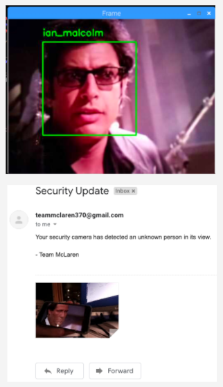

# Pi-Security-Camera

## About Project
The Raspberry Pi Security Camera that notifies of intruders is a camera built from a Raspberry Pi 3, that is able to distinguish between certain people and objects through machine-learning. If a non-user enters the camera's field of view, an email notification is sent alerting the user. Attached to the email is a picture of what the camera picked up.

## Example Output
Here is an example of Ian Malcom from Jurassic Park being recognized by the security as well as an email example.
 

## Hardware
The hardware used for this project are listed below.
- Raspberry Pi 3
- Raspberry Pi Camera Module V2 (8MP)
- PI Noir Camera Module V2 (8MP) (Optional Night Vision)

## Installation

#### OpenCV
This project is built off the foundation of OpenCV. This highly optimized library is used to provide facial recognition in a python environment. For this project to work, openCV is the first thing that needs to be installed. The link below walks through how to install an OpenCV on a Raspberry Pi. A word of caution before starting the installation, if the Raspberry Pi used does not have a lot of memory, it will take a very long time to install. Due to this, it is recommended to have a Raspberry Pi 3 or higher.
https://www.learnopencv.com/install-opencv-4-on-raspberry-pi/

#### Python Libraries
Once OpenCV is installed, the following commands will finish the environment's setup. "workon cv" will be the in OpenCv python environment. From here, pip is used to install a few more libraries needed.
``` bash
workon cv
pip install dlib
pip install face_recognition
pip install imutils
```

#### Fillout Email Template
This repository comes with templates to be filled out for the message and picture to be sent to an email. Two places must be filled out to have an email be sent. The first is message.txt. This is a simple text file where the body of an email message can be added. The other place is in the python file pi_face_recognition.py. There are comments in this file that show where an email and password need to be added.

#### Dataset Encoding For New Faces
Before running the security camera, the last step is to apply a dataset of faces the camera can detect. To do this, navigate to the dataset folder, create a new folder, and add photos of the person that wants to be detected. Make sure to have pictures of just the individual's face. From here, the follow command can be used to encode the dataset.
````bash
python encode_faces.py --dataset dataset --encodings encodings.pickle --detection-method hog
````
## Running
With the environment setup, you can use the following commands to start the security camera.
``` bash
workon cv
python pi_face_recognition.py --cascade haarcascade_frontalface_default.xml --encodings encodings.pickle
```

